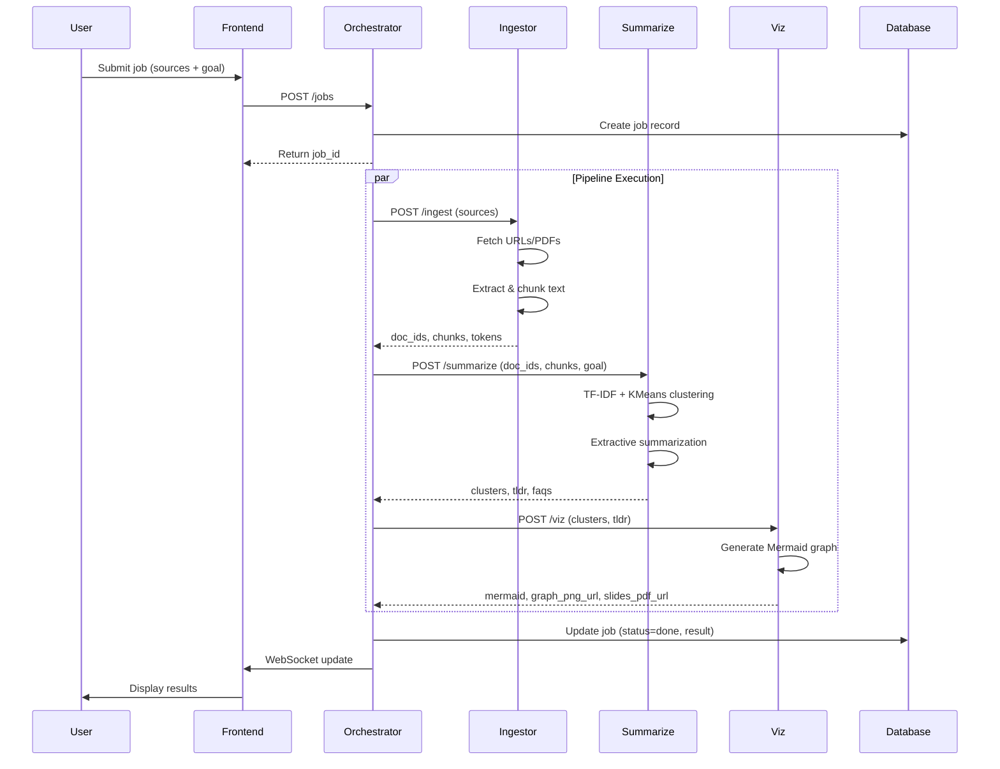

# SynthIQ Architecture

## Overview

SynthIQ is a multi-agent research summarization system that processes content from URLs and PDFs, extracts insights through clustering and summarization, and visualizes results as knowledge graphs.

## System Architecture

### High-Level Components

```
┌─────────────┐
│   Frontend  │ (React + TypeScript + Vite)
│  Port 5174  │
└──────┬──────┘
       │ HTTP/WebSocket
       ▼
┌─────────────────┐
│  Orchestrator    │ (FastAPI)
│  Port 8080       │
└──────┬───────────┘
       │
       ├──────────────┬──────────────┬──────────────┐
       │              │              │              │
       ▼              ▼              ▼              ▼
┌──────────┐  ┌──────────┐  ┌──────────┐  ┌──────────┐
│ Ingestor │  │Summarize │  │   Viz    │  │ Database │
│ Port 8081│  │Port 8082 │  │Port 8083 │  │ (SQLite) │
└──────────┘  └──────────┘  └──────────┘  └──────────┘
```

## Request Flow

### Sequence Diagram



## Service Details

### Orchestrator (Port 8080)

**Responsibilities:**
- Job lifecycle management
- Pipeline orchestration
- WebSocket real-time updates
- Rate limiting (10 req/min)
- Request size validation (2MB max)

**Endpoints:**
- `POST /jobs` - Create new job
- `GET /jobs` - List jobs
- `GET /jobs/{job_id}` - Get job status
- `GET /healthz` - Health check
- `GET /version` - Version info
- `WS /ws/jobs/{job_id}` - WebSocket updates

**Database:**
- SQLModel with SQLite (dev)
- PostgreSQL ready (production)

### Ingestor (Port 8081)

**Responsibilities:**
- Fetch content from URLs
- Extract text from PDFs
- Chunk text with provenance
- Validate URLs (http/https only)
- Strip scripts from HTML

**Endpoints:**
- `POST /ingest` - Ingest sources
- `GET /healthz` - Health check
- `GET /version` - Version info

**Output:**
- `doc_ids`: List of document IDs
- `chunks`: Text chunks with metadata (chunk_id, doc_id, start, end)
- `total_tokens`: Approximate token count

### Summarize (Port 8082)

**Responsibilities:**
- TF-IDF + KMeans clustering
- Extractive summarization (TextRank-style)
- Generate TL;DR
- Create FAQs
- Deterministic clustering (with seed)

**Endpoints:**
- `POST /summarize` - Summarize documents
- `GET /healthz` - Health check
- `GET /version` - Version info

**Algorithm:**
1. Vectorize chunks using TF-IDF
2. Cluster using KMeans (deterministic with seed)
3. Extract top sentences per cluster (TextRank)
4. Generate citations with provenance

### Viz (Port 8083)

**Responsibilities:**
- Generate Mermaid diagrams
- Create visualization assets
- Export formats (PNG, PDF)

**Endpoints:**
- `POST /viz` - Generate visualization
- `GET /healthz` - Health check
- `GET /version` - Version info

## Deployment Architecture

### Cloud Run (Future)

```mermaid
graph TB
    subgraph "Cloud Run Services"
        O[Orchestrator Service]
        I[Ingestor Service]
        S[Summarize Service]
        V[Viz Service]
    end
    
    subgraph "Cloud SQL"
        DB[(PostgreSQL)]
    end
    
    subgraph "Cloud Storage"
        ST[Job Results]
    end
    
    subgraph "Load Balancer"
        LB[HTTPS Load Balancer]
    end
    
    subgraph "CDN"
        CDN[Cloud CDN]
    end
    
    User --> LB
    LB --> CDN
    CDN --> O
    O --> I
    O --> S
    O --> V
    O --> DB
    O --> ST
```

## Performance Budgets

### Per-Request Timeouts

- **Ingestor**: 30s per URL/PDF fetch
- **Summarize**: 60s for clustering + summarization
- **Viz**: 10s for graph generation
- **Total Pipeline**: 120s max

### Rate Limits

- **Per IP**: 10 requests/minute
- **Request Size**: 2MB max
- **Sources per Job**: 20 max

## Security Notes

### Input Validation

- URL scheme validation (http/https only)
- Block file:// and data: URLs
- Script stripping in HTML parsing
- Request size limits (2MB)
- Rate limiting per IP

### Data Privacy

- No persistent storage of raw content (chunks only)
- Job results stored with TTL (15 minutes)
- Max 50 jobs in memory store

### API Security

- CORS configured per service
- Environment-based configuration
- No authentication (to be added)

## Data Flow

### Job Creation

1. User submits sources + goal
2. Orchestrator validates request
3. Job record created in database
4. Pipeline task spawned asynchronously

### Pipeline Execution

1. **Ingest**: Fetch and chunk content
2. **Summarize**: Cluster and extract summaries
3. **Visualize**: Generate knowledge graph
4. **Store**: Save results to database

### Real-Time Updates

- WebSocket connections per job
- Progress updates (ingest %, summarize %, viz %)
- Status changes (pending → running → done/error)
- Result delivery

## Technology Stack

### Backend
- **FastAPI**: Web framework
- **SQLModel**: ORM (SQLite/PostgreSQL)
- **scikit-learn**: Clustering (TF-IDF, KMeans)
- **BeautifulSoup4**: HTML parsing
- **pypdf**: PDF extraction
- **httpx**: Async HTTP client
- **tenacity**: Retry logic

### Frontend
- **React**: UI framework
- **TypeScript**: Type safety
- **Vite**: Build tool
- **Tailwind CSS**: Styling
- **Zustand**: State management
- **Framer Motion**: Animations
- **Mermaid**: Graph rendering

### Infrastructure
- **Docker**: Containerization
- **docker-compose**: Local orchestration
- **GitHub Actions**: CI/CD
- **Cloud Run**: Deployment target (future)

## Future Enhancements

- **Pub/Sub**: Long-running job queue
- **Firestore**: Scalable job persistence
- **Vertex AI**: LLM-guided chunk ranking
- **Monitoring**: Prometheus + Grafana
- **Auth**: Supabase Auth integration
- **Caching**: Redis for frequent queries

